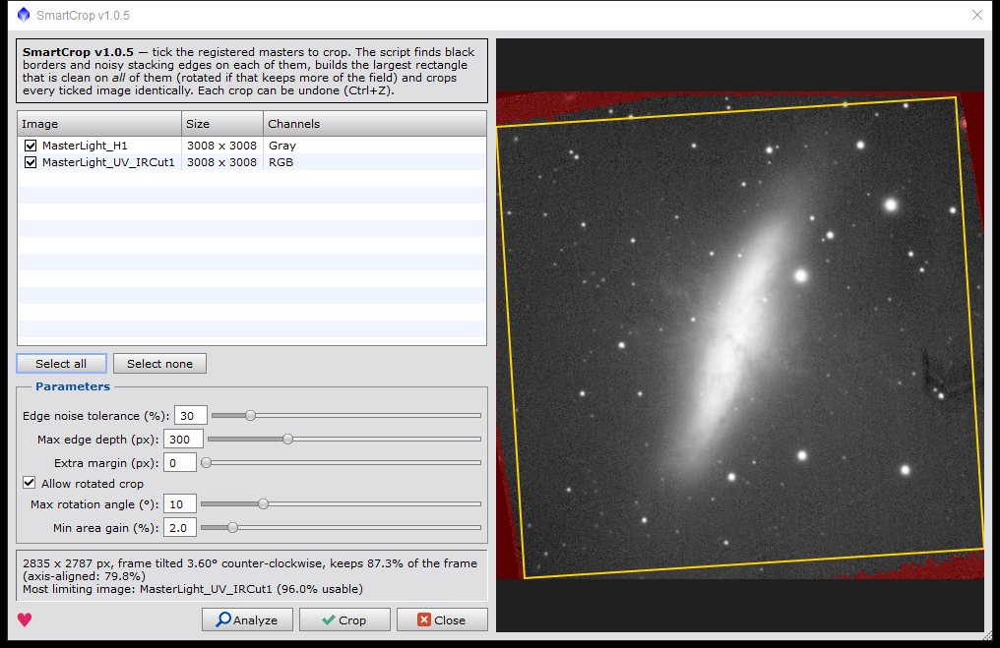

# SmartCrop for PixInsight

**Synchronized automatic crop of master frames — with optional registration.**



Open your masters (L, R, G, B, Ha, OIII, SII… or OSC), tick them in the list and press **Crop**. SmartCrop:

1. finds on every image the area without data (black borders left by registration and rotation) and the noisy stacking edges next to it — areas covered by fewer subframes, detected by the local noise level, so gradients and vignetting are not mistaken for defects;
2. keeps only the area that is clean on **all** selected images;
3. finds the largest rectangle inside it, **at any angle** — the crop is rotated only if that keeps noticeably more of the field;
4. crops (and rotates, if needed) every selected image identically, so they stay registered to each other.

**Masters that are not registered to each other** (stacked in other software, on different nights or with different cameras): untick *Images are already registered to each other*. SmartCrop then registers them first — by stars (StarAlignment), or by their astrometric solutions when star matching fails and every image is plate-solved. The reference is chosen automatically: the image that needs the least rotation of the best common crop, so it is resampled as little as possible.

After **Analyze** the window shows a preview of the most limiting image: unusable area in red, the crop frame in yellow (mouse wheel zooms, drag pans, double click fits). Registration and crop are normal undoable steps (Ctrl+Z). Before touching your images SmartCrop dry-runs the crop on the combined mask and refuses to proceed if a single bad pixel would remain.

## Installation

1. In PixInsight: **Resources › Updates › Manage Repositories › Add** and enter
   ```
   https://raw.githubusercontent.com/BananAndrews/SmartCrop/main/repository/
   ```
2. **Resources › Updates › Check for Updates**, install, restart PixInsight.
3. Run it from **Script › Utilities › SmartCrop**.

New versions arrive through **Check for Updates** automatically. PixInsight 1.8.9 or newer. The repository is not signed yet, so PixInsight asks for confirmation once.

## Settings

| Setting | Default | Meaning |
|---|---|---|
| Images are already registered to each other | on | untick to let SmartCrop register the masters first |
| Edge noise tolerance | 30 % | edge areas noisier than the interior by more than this are cut off (lower = stricter) |
| Max edge depth | 300 px | how deep from the data border noisy edges are searched |
| Extra margin | 0 px | additional safety margin |
| Allow rotated crop | on | rotate the crop (any angle) when that keeps more of the field |
| Min area gain | 2 % | rotate only if the rotated crop is at least this much larger than the best upright one (rotation resamples the images) |

Registered images must have the same dimensions; unregistered ones may differ in size, orientation and scale. An existing astrometric solution is removed after cropping — plate-solve again afterwards.

## Support

SmartCrop is free. If it helped you — **[♥ support the author via PayPal](https://www.paypal.com/donate/?business=contact%40bluebelleweddings.com&no_recurring=0&item_name=SmartCrop)** (the same heart is in the script window).

## License

Free to use; all rights reserved. Modification and redistribution of modified versions are not permitted — see [LICENSE](LICENSE).

---

# SmartCrop для PixInsight

**Синхронный автоматический кроп мастеров — с совмещением, если нужно.**

Откройте мастера (L, R, G, B, Ha, OIII, SII… или цветной OSC), отметьте их галочками и нажмите **Crop**. SmartCrop:

1. находит на каждом кадре область без данных (чёрные поля после выравнивания и поворота) и шумные края сложения рядом с ней — участки, где сложилось меньше кадров; они определяются по уровню шума, поэтому градиенты и виньетирование не принимаются за дефекты;
2. оставляет только область, чистую на **всех** выбранных кадрах;
3. находит в ней максимальный прямоугольник **под любым углом** — рамка поворачивается, только если так сохраняется заметно больше поля;
4. одинаково обрезает (и при необходимости поворачивает) все выбранные кадры, совмещение между ними сохраняется.

**Если мастера не совмещены между собой** (сложены в другой программе, в разные ночи или разными камерами) — снимите галочку *Images are already registered to each other*. SmartCrop сначала совместит их: по звёздам (StarAlignment), а если звёзды не сопоставились и у всех кадров есть image solve — по координатам неба. Референс выбирается автоматически: кадр, которому нужен наименьший поворот лучшей общей рамки, чтобы картинка пересчитывалась как можно меньше.

После **Analyze** в окне скрипта видно превью: непригодная область красная, рамка кропа жёлтая (колесо мыши — масштаб, перетаскивание — сдвиг, двойной клик — вписать). Совмещение и кроп отменяются через Ctrl+Z. Перед изменением кадров SmartCrop проверяет кроп на общей маске и не продолжит, если в кадр попадёт хоть один плохой пиксель.

## Установка

1. В PixInsight: **Resources › Updates › Manage Repositories › Add**, адрес
   ```
   https://raw.githubusercontent.com/BananAndrews/SmartCrop/main/repository/
   ```
2. **Resources › Updates › Check for Updates**, установить, перезапустить PixInsight.
3. Скрипт: **Script › Utilities › SmartCrop**.

Новые версии приходят через **Check for Updates** автоматически. Нужен PixInsight 1.8.9 или новее. Репозиторий пока без подписи, поэтому PixInsight один раз спросит подтверждение.

## Поддержка

SmartCrop бесплатный. Если он вам помог — **[♥ поддержать автора через PayPal](https://www.paypal.com/donate/?business=contact%40bluebelleweddings.com&no_recurring=0&item_name=SmartCrop)** (такое же сердечко есть в окне скрипта).

## Лицензия

Бесплатно для использования, все права защищены. Изменение и распространение изменённых версий запрещены — см. [LICENSE](LICENSE).
